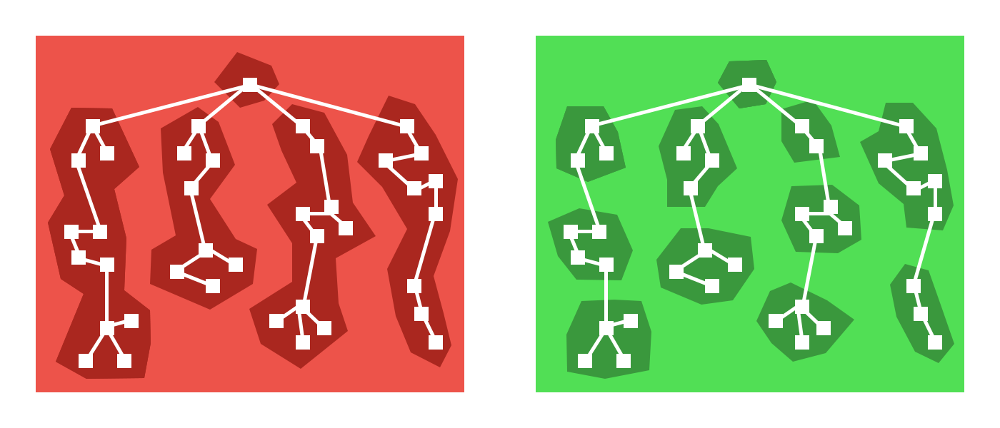

### 一、为什么要进行代码拆分
在以往的性能优化清单中，减少`HTTP`请求一直是其中的一项。事实上，也做到了。在目前的大多数应用开发中都会用到   `webpack` 进行应用的构建打包，从而将我们应用以及应用所需的模块打包成一个大 `bundle`。这样也确实是减少了`HTTP`的请求。但是这样做有几个明显的劣势：

 1. 首屏加载时间过长，导致白屏，移动端网络不稳定尤甚
 2. 当你修改了业务代码以后，整个大的 `bundle` 要重新下载。

### 二、怎样对代码进行拆分

先看一下 `webpack` 进行代码分离的几种方法：

- 在入口处配置 `entry` 进行分离
- 防止重复，使用`CommonsChunkPlugin`去重和分离`chunk`
- 动态导入：使用模块的内联函数

#### 1、在入口处配置进行分离

``` javascript
entry: {
        app: './src/entry.js',
        vendor: ['react', 'react-dom']
    },
```

对于一些不常变动的库，比如框架，第三方依赖等等，可以直接在入口就进行代码的分离，就好比这里的`react`、`react-dom`

#### 2、防止重复，使用  CommonsChunkPlugin

这个插件可以将公共模块依赖提取到已有的chunk中，比如下面这样

``` javascript
new webpack.optimize.CommonsChunkPlugin({
    name: 'common',
}),
```

当然，这个插件在`webpack`4.0以上的版本被废弃掉了，具体的可以查看[SplitChunksPlugin][1]

#### 3、使用`import()`来进行动态导入

`import()`的相关文档可以查看[import()相关文档][2]

当然，使用`import()`需要用到`babel-plugin-syntax-dynamic-import`插件

`import()`的使用如下：

``` javascript
import('lodash').then(_ => {
    // do something
})
```

但这样写的话，每次都很麻烦，这里有一个高阶组件来处理这个事情

``` javascript
import React from 'react';

export default function asyncComponent(importComponent) {
  class AsyncComponent extends React.Component {
    constructor(props){
      super(props);
      this.state = {
        Component: null,
      }
    }
    componentDidMount() {
       importComponent().then(module => {
        // const { default: component } = res;
         this.setState({ Component: module.default });
       });
    }
    render(){
      const { Component } = this.state;
      return Component ? <Component { ...this.props } /> : null;
    }
  }
  return AsyncComponent;
}
```

有了这个高阶组件，使用就方便了：

``` javascript
const Result = asyncComponent(() => import('./container/result/result'))
```

`import`规范不允许控制模块的名称或其他的属性，因为`chunks`是`webpack`的概念。如果像上面那样直接使用的话，输出的就像下面这样


好在`webpack`可以注释接受一些特殊的参数,但还要在配置文件的`output`加上`chunkFilename`

``` javascript
// 第一处修改
 const Result = asyncComponent(() => import(/* webpackChunkName: "result" */ './container/result/result'))
// 第二处修改
output: {
        path: '/',
        publicPath: '/',
        chunkFilename: '[name].bundle.js',
        filename: '[name].[hash].js',
    },
```

这样，上面的模块就会被命名为`result.bundle.js`，而不是`[id].bundle.js`。

其实做到这一步，就已经做到了代码拆分。但是有一个比较好的库更适合做这个事情，这个库就是`react-loadable`，使用如下：

``` javascript
const Home = Loadable({
    loader: () => import(/* webpackChunkName: "Home" */ './container/Home/home'),
    loading: () => {
        return <div>loading</div>
    },
})
```

有的组件加载实在过快（<200ms），那么这个我们可以给一`Loading`组件来设置延迟时间

``` javascript
function Loading(props) {
  if (props.error) {
    return <div>Error! <button onClick={ props.retry }>Retry</button></div>;
  } else if (props.pastDelay) {
    return <div>Loading...</div>;
  } else {
    return null;
  }
}
```

接着使用`react-loadable`

``` javascript
const Home = Loadable({
    loader: () => import(/* webpackChunkName: "Home" */ './container/Home/home'),
    loading: Loading,
    delay: 200, // 200ms内加载出来的话，不显示加载状态
})
```

想了解更多`react-loadable`，可以点击[react-loadable][4]

#### 完整代码

``` javascript
import React from 'react';
import { Route, Router, BrowserRouter, HashRouter, Switch, Redirect } from 'react-router-dom';
import { ConnectedRouter } from 'react-router-redux';
import createHistory from 'history/createHashHistory';
import App from './container/app';
import Loadable from 'react-loadable';

const Home = Loadable({
    loader: () => import(/* webpackChunkName: "Home" */ './container/Home/home'),
    loading: () => {
        return <div>loading</div>
    }
})

const Result = Loadable({
    loader: () => import(/* webpackChunkName: "result" */ './container/result/result'),
    loading: () => {
        return <div>loading...</div>
    }
})

const history = createHistory();

class Routers extends React.Component {
    render() {
        return (
            <HashRouter>
                <App>
                    <Switch>
                        <Route exact path="/" render={() => (<Redirect to="/home" />)} />
                        <Route path="/home" component={Home} />
                        <Route path="/second" component={Result} />
                    </Switch>
                </App>
            </HashRouter>
        )
    }
}
export default Routers;
```

#### 最后

代码拆分有两种思路，一种是基于路由拆分，一种是基于组件拆分



左边这幅图是基于路由拆分的示意图，右边的是基于组件拆分的示意图，可以看到基于组件进行拆分的粒度更细一点。

考虑这样一个场景，你有多个tab，可能有一些tab你从进入应用到离开应用都不会去点击它，那么每个tab页面下的组件就很适合进行代码拆分。这完全根据你的应用场景来决定的。

如果你想对你的一些组件进行拆分，也是同样的使用```react-loadable```


  [1]: https://webpack.docschina.org/plugins/split-chunks-plugin/
  [2]: https://webpack.docschina.org/api/module-methods#import-
  [4]: https://github.com/jamiebuilds/react-loadable